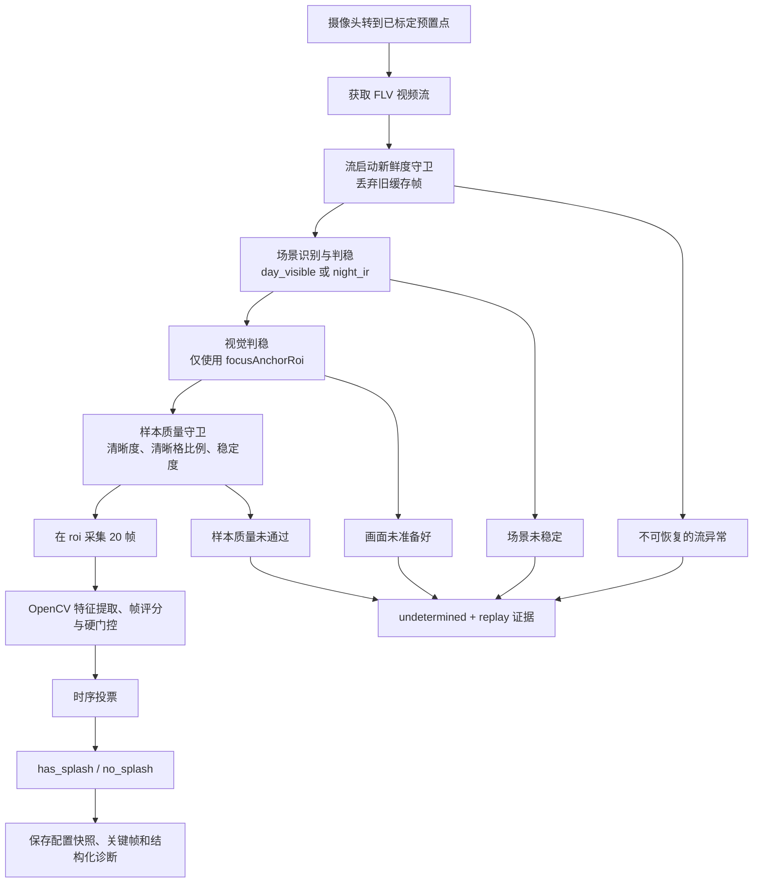

# 增氧机水花识别系统：阶段成果与技术说明

日期：2026-07-16  
适用对象：业务汇报、现场沟通与技术答疑

## 1. 系统解决什么问题

系统通过摄像头观察单台增氧机的预置点画面，判断水面是否存在该增氧机工作时应有的水花。它提供的是**视觉状态**：`has_splash`（有水花）、`no_splash`（无水花）或 `undetermined`（本次未形成可靠结论）。

视觉状态不等于设备故障。后续若要生成“增氧机异常”告警，仍需把可靠的 `no_splash` 与控制柜或平台提供的设备运行状态交叉比对。

## 2. 当前阶段成果

- 已完成单目标识别、双 ROI 标定、现场回放证据保存和伪多点切换回归工具。
- 白天可见光与夜间固定红外黑白均有独立参数基线。
- 夜间采用固定 IR 后，最近一次现场连续测试共 `100` 轮未出现失败。该结论仅覆盖当前摄像头、当前标定、当前预置点和固定 IR 条件；不代表所有点位、天气、镜头或未来多目标调度场景均已验收。
- 夜间关键阈值经过历史 replay 离线扫描：有水花 `19/19`、无水花 `20/20` 的扫描样本均正确，`hardGateMinGapFillRatio` 收敛为 `0.76`。

## 3. 识别方式：不是训练模型，而是可解释的规则视觉

当前版本**没有使用深度学习分类模型、目标检测模型或大语言/视觉模型**。它采用 OpenCV 图像处理和短时序规则判定，选择这一方案的原因是：现场可解释、可离线回放调参、无需积累大量标注数据，也便于把失败定位到具体环节。

### 每帧提取的主要证据

在识别 ROI 内，系统将画面灰度化并提取水花的亮区和变化特征，包括：

- 最大亮区面积占比：排除极小亮点。
- 中心亮区覆盖、纵向展开和连续亮区比例：判断亮区是否具备水花的空间形态。
- 暗缝填充比例（`gapFill`）：判断亮区是否呈连续水花主体，而非零散反光或碎片。
- 局部残差运动、动态面积和高亮扰动：判断亮区是否存在符合水花的变化。
- 亮区面积与形状的帧间变化：补充短时序证据。

单帧得分之外，夜间还必须通过结构硬门控。例如亮区主体、中心覆盖、纵向展开、连续性和 `gapFill` 不足时，即使单帧看起来较亮也不会直接判为水花。白天另有静态亮斑/白泡沫抑制，避免把长期不动的白色区域误判成水花。

### 为什么要看多帧

系统默认采集 `20` 帧、约 `10 fps`、约 `2` 秒的短序列。每帧先完成特征提取、评分和硬门控，再按帧通过率与序列投票阈值（当前均为 `0.60`）输出最终视觉状态。这样不会因一张偶发模糊帧、反光帧或转点残帧直接改变结果。

## 4. 运行时流程

流程中的两个 ROI 用途不同，不能混用：

- `roi`：水花特征提取和最终判定区域。
- `focusAnchorRoi`：画面是否已对焦、稳定、可采样的依据。通常应选择稳定且纹理清晰的固定参照物，而不是变化强烈的水花本身。

旧标定缺失 `focusAnchorRoi` 时可临时回退到 `roi`，但新标定应始终显式设置双 ROI。

## 5. 白天与夜间策略

| 场景 | 运行策略 | 关键说明 |
| --- | --- | --- |
| 白天可见光 | `day_visible` | 使用短时序水花特征，并启用静态亮斑/白泡沫抑制。当前 sample-quality 超时为 `5200 ms`。 |
| 黄昏仍为可见光 | `day_visible_twilight` | 不是新的水花算法，只增加判稳与采样恢复等待预算，避免亮度下降时过早失败。 |
| 夜间 | `night_ir` | 摄像头固定为红外黑白。以亮区结构证据为主、弱动态证据为辅；sample-quality 超时为 `5700 ms`。 |

当前明确不支持在一次识别过程中从彩色切到 IR 或从 IR 切到彩色。摄像头的日夜切换存在设备响应延迟，会使同一轮的前后画面不具备同一套稳定假设；现场运行应将夜间摄像头固定在 IR 模式。

## 6. 技术栈与系统组成

| 层级 | 技术 | 作用 |
| --- | --- | --- |
| 后端 API | Python、FastAPI、Pydantic、Uvicorn | 设备、预置点、视频流和标定配置接口。 |
| 视觉识别 | OpenCV、NumPy | FLV 解码、灰度/阈值处理、形态与连通域特征、清晰度与时序分析。 |
| 摄像头集成 | HTTP API、FLV 流 | 获取鉴权、预置点控制、设备状态查询和视频画面。 |
| 前端标定 | React、TypeScript、Vite | 预置点操作、快照查看、`roi` 与 `focusAnchorRoi` 分别标定。 |
| 回归与复盘 | Python `unittest`、replay、伪多点测试工具 | 保存关键帧、配置快照与结构化指标，支持离线重放和阈值扫描。 |

## 7. 为稳定性已处理的工程问题

- **转点残帧与旧缓存帧**：流启动新鲜度守卫先消耗旧帧，再进入识别。
- **日夜模式尚未收敛**：先做场景判稳，完整窗口连续稳定后才锁定参数 profile；不完整窗口不会误判稳定。
- **转点后虚焦或抖动**：视觉判稳和正式采样质量守卫都使用独立的对焦锚点 ROI；支持有限次数短恢复。
- **断流拖慢整轮**：设置 OpenCV 读流超时，快速识别 EOF/异常读失败，并仅在明确流故障时重开一次会话。
- **夜间真实水花碎裂导致假阴性**：通过带标签 replay 扫描将夜间 `gapFill` 阈值收敛为 `0.76`，不同时放松其他门控。
- **无法解释的失败**：每轮保存 replay、关键帧、配置快照、场景、质量拒绝计数、硬门控与时序投票结果，便于区分“没有水花”“画面不可靠”和“流异常”。

## 8. 现行关键参数

参数的唯一可执行来源是 [`backend/local_config.example.json`](../backend/local_config.example.json)。以下仅为汇报所需的关键快照：

| 参数 | 当前值 | 含义 |
| --- | ---: | --- |
| `sceneMode` | `auto` | 在稳定后自动选择白天或夜间 IR profile。 |
| 场景判稳 | `2` 窗口 x `4` 帧，`1600 ms` | 阻止日夜模式切换期间进入采样。 |
| 采样序列 | `20` 帧、`10 fps`、`2000 ms` | 最终水花判定的短时序窗口。 |
| `framePassThreshold` | `0.60` | 单帧综合得分阈值。 |
| `sequenceVoteThreshold` | `0.60` | 序列通过率阈值。 |
| 夜间 `hardGateMinGapFillRatio` | `0.76` | 夜间亮区连续性硬门控。 |
| 夜间 `hardGateMinCenterBrightCoverage` | `0.46` | 夜间亮区中心覆盖硬门控。 |
| 夜间采样质量超时 | `5700 ms` | 给转点后焦点恢复的最大预算。 |

## 9. 系统边界与后续方向

本阶段不包含生产级多目标调度、设备运行状态接入、自动告警派发、HLS 降级、按单一预置点维护专属水花阈值、构图守卫，以及夜间彩色/IR 动态切换处理。

后续若进入生产接入，建议按以下顺序推进：

1. 将稳定识别结果与控制柜/平台的设备运行状态接入，定义异常告警规则。
2. 在多个增氧机、多个预置点与不同天气条件下扩展回归样本，验证参数泛化范围。
3. 只有当新场景反复证明现有规则不足时，才按证据评估专属阈值或学习型模型；不以“增加模型”为默认方向。

## 10. 常见问题与建议回答

**这是 AI 识别模型吗？**  当前不是训练型 AI 模型，而是 OpenCV + NumPy 的可解释规则视觉系统。它从连续画面中提取亮区形态、连续性和动态变化，再用硬门控与时序投票判定。后续是否引入学习型模型，应由多点位数据证明现有规则的泛化边界后再决定。

**为什么不只看一张截图？**  水花、反光、模糊和转点残帧都可能使单帧失真。系统以约 2 秒的 20 帧序列作结论，并在采样前确认画面已经稳定和清晰。

**为什么要有两个 ROI？** `roi` 用来观察水花，`focusAnchorRoi` 用来确认镜头已经对焦和稳定。水花区域本身会变化，通常不适合承担对焦判稳职责；分开后可减少“目标在画面内但尚未稳定就开始识别”的失败。

**100 轮无失败代表什么？** 它证明当前固定 IR、当前摄像头、当前标定和当前单点条件下的连续运行稳定性。汇报时应同时说明测试中有水花/无水花的实际构成和匹配结果；不能把“流程未失败”单独等同于任意环境下的识别准确率。

**无水花就是设备坏了吗？** 不是。`no_splash` 仅表示视觉上未观察到预期水花。设备异常需要再结合控制柜或物联网平台的启停、供电等设备状态判断，避免把设备停机、维护或镜头问题直接报为故障。

**为什么夜间要求固定红外黑白？** 摄像头自动在彩色与 IR 间切换存在响应延迟，可能在一轮识别中改变成像特性。固定 IR 能保证整轮使用同一套夜间特征和阈值，使结果可复现。

## 11. 汇报时可直接使用的结论

> 当前系统已形成一套面向单台增氧机的、可解释的短时序视觉识别能力。它通过双 ROI 标定、画面判稳、样本质量守卫、OpenCV 结构与动态特征、硬门控和多帧投票识别水花状态，并为每次结果保留可回放证据。夜间已固定为红外黑白运行，在当前现场条件下最近连续 100 轮测试未失败。系统下一阶段重点是接入设备状态并扩展多点现场验证，而不是盲目增加新的识别模型。
